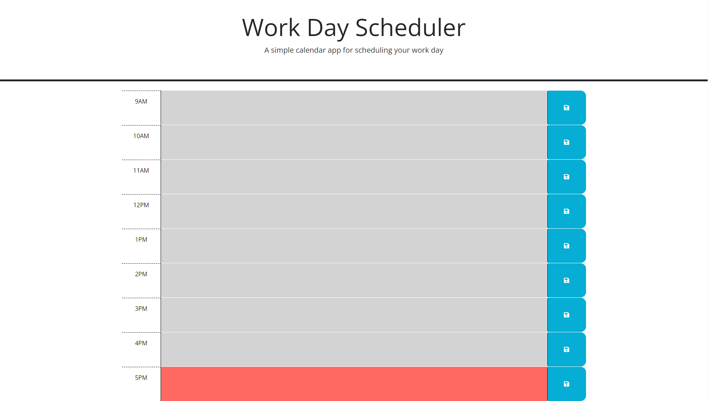

# Work Day Scheduler!

#### This Week's Bootcamp Odd-Number Challenge: 
Our assignment for Week Three is to take an already-established code and adjust it to make a working Work Day Scheduler.

## Link To Website
[Click here to be re-directed!](https://callbeyond.github.io/WorkDayScheduler/ "Click here to generate a password!")

## Usage
Enter any notes that you may need for that specific time period, and even if you exit and return to the page it'll still be there stored for you!  

## Screenshots

## Credits

UofM-VIRT-FSF-PT-10-2023-U-LOLC-ENTG
## License

[MIT](https://choosealicense.com/licenses/mit/)

